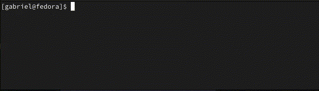

# Snap Simulator
Command line application that simulates a game of snap between computer-controlled players.



In this game, a deck of cards is split between players, who then take turns revealing cards one by one. If any of the
last cards revealed by each player match, the first player to shout "snap!" wins the round and takes all the revealed
cards.

The winner of the game is the player who has won the most cards when a configured stop condition is met (by default,
after only one round).

## Dependencies
- Build process must be run from [IntelliJ IDEA](https://www.jetbrains.com/idea/).
- Project is configured for Java 21

## Compilation
- Open the project root directory in IntelliJ IDEA
- `Main Menu -> Build -> Build Artifacts -> snap-simulator:jar -> Build`
- Find output at path `out/artifacts/snap_simulator_jar/snap-simulator.jar`

## Usage
To run a simple one-round game of snap between two players using a 52-card french-suited deck:

```bash
java -jar snap-simulator.jar
```

Use command-line arguments to configure your game. For example, the following command runs a 4-player game of snap
with jokers, only stopping once all the players run out of cards to reveal:

```bash
java -jar snap-simulator.jar -p 4 --jokers --stop-on-card-exhaustion
```

Many different arguments are available to customise your game. For a full list, use the help command:
```bash
java -jar snap-simulator.jar --help
```

## Troubleshooting
- Ensure the `java` command in your terminal points to Java 21.
- If you cannot run the jar file, you can also try adding CLI arguments from IntelliJ IDEA through 